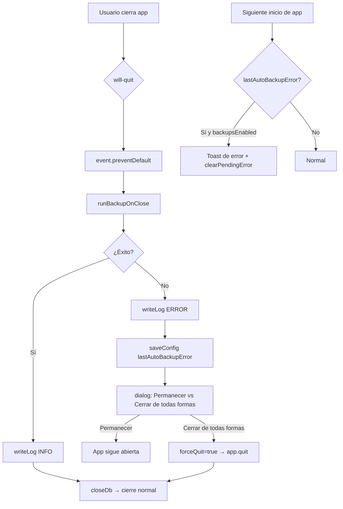

---

todos:

- id: "logger"
content: "Crear src/main/logger.ts con writeLog, getLogsPath y cleanOldLogs"
status: pending
- id: "config"
content: "Agregar lastAutoBackupError a BackupConfig en config.ts"
status: pending
- id: "backup"
content: "Integrar writeLog en backup.ts y guardar error en config en runBackupOnClose"
status: pending
- id: "activitylog"
content: "Ampliar ActionType con 'config' en activityLog.ts"
status: pending
- id: "ipc"
content: "Agregar backup:getPendingError, backup:clearPendingError y loguear toggle de backupsEnabled en ipc.ts"
status: pending
- id: "main"
content: "Interceptar will-quit con dialog en main.ts, loguear inicio/cierre de app"
status: pending
- id: "preload-types"
content: "Actualizar preload.ts y vite-env.d.ts con nuevos IPCs y tipos"
status: pending
- id: "settings"
content: "Mostrar pendingError al cargar Settings.tsx y registrar toggle en bitácora"
status: pending
isProject: false

---

# Plan: Backup Logging & Notificaciones de Error

## Dependencia nueva

```bash
npm install electron-log
```

`electron-log` es la librería estándar para logging en apps Electron. Soporta múltiples transportes (archivo, consola), formato configurable y rotación por día vía `resolvePathFn`.

## Archivos nuevos

### `src/main/logger.ts`

Módulo de logging técnico basado en `electron-log`:

```typescript
import log from 'electron-log/main'
import path from 'path'
import fs from 'fs'
import { loadConfig } from './config'

export function initLogger(): void {
  // resolvePathFn se llama en cada escritura → path dinámico según config actual
  log.transports.file.resolvePathFn = () => {
    const config = loadConfig()
    if (!config.backupPath?.trim()) return '' // sin path = sin log
    const logsDir = path.join(config.backupPath, '..', 'logs')
    if (!fs.existsSync(logsDir)) fs.mkdirSync(logsDir, { recursive: true })
    const now = new Date()
    const Y = now.getFullYear()
    const M = String(now.getMonth() + 1).padStart(2, '0')
    const D = String(now.getDate()).padStart(2, '0')
    return path.join(logsDir, `curo_${Y}-${M}-${D}.log`)
  }
  log.transports.file.format = '[{y}-{m}-{d} {h}:{i}:{s}] [{level}] {text}'
  log.transports.console.level = false // solo archivo, sin consola en prod
}

export function writeLog(level: 'info' | 'warn' | 'error', message: string): void {
  const config = loadConfig()
  if (!config.backupPath?.trim()) return // sin carpeta configurada, no logueamos
  log[level](message)
}

export function cleanOldLogFiles(): void {
  const config = loadConfig()
  if (!config.backupPath?.trim()) return
  const logsDir = path.join(config.backupPath, '..', 'logs')
  if (!fs.existsSync(logsDir)) return
  const cutoff = Date.now() - 3 * 24 * 60 * 60 * 1000
  for (const file of fs.readdirSync(logsDir)) {
    if (!file.startsWith('curo_') || !file.endsWith('.log')) continue
    const fullPath = path.join(logsDir, file)
    try {
      if (fs.statSync(fullPath).mtime.getTime() < cutoff) fs.unlinkSync(fullPath)
    } catch {}
  }
}
```

- `initLogger()` se llama una vez al iniciar la app.
- `resolvePathFn` es dinámico: si el usuario cambia la carpeta de backups, el siguiente log ya va al nuevo path.
- `writeLog()` hace la verificación de backupPath antes de escribir.
- `cleanOldLogFiles()` purga archivos `curo_*.log` con más de 3 días al iniciar.

## Archivos modificados

### `src/main/config.ts`

Agregar campo a `BackupConfig`:

```typescript
lastAutoBackupError: string | null  // mensaje del último fallo automático
```

Valor por defecto: `null`.

### `src/main/backup.ts`

- Importar `writeLog` del logger.
- `runBackup()`: loguear éxito (`INFO`) y fallo (`ERROR`). Traducir `ENOSPC` a "Sin espacio en disco". Retornar el mensaje de error ya traducido.
- `runBackupOnClose()`: si falla, guardar el error en config (`saveConfig({ lastAutoBackupError: mensaje })`) además de loguearlo.
- `restore()` y `revertRecovery()`: loguear éxito y fallo.

### `src/main/activityLog.ts`

Ampliar `ActionType` para incluir `'config'`, permitiendo registrar cambios de configuración sin entidad asociada.

### `src/main/ipc.ts`

- Modificar `config:set` para detectar cuando cambia `backupsEnabled` y llamar `logAction('config', ...)`.
- Agregar `backup:getPendingError` → retorna `config.lastAutoBackupError`.
- Agregar `backup:clearPendingError` → llama `saveConfig({ lastAutoBackupError: null })`.

### `src/main/main.ts`

**Flujo en `will-quit` (botón salir / Cmd+Q):**

```
will-quit
  → event.preventDefault()
  → runBackupOnClose()
  → si falla: dialog.showMessageBox({ tipo warning,
      botón "Permanecer" (preferido/default),
      botón "Cerrar de todas formas" (destructivo) })
    → si "Permanecer": no hace nada, app sigue viva
    → si "Cerrar": setForceQuit(true) → app.quit()
  → si éxito: closeDb() → app continúa cerrándose
```

Flag `forceQuit` para evitar bucle infinito al re-llamar `app.quit()`.

**En `app.whenReady()`:**

- Llamar `logger.cleanOldLogs()`.
- Llamar `logger.writeLog('INFO', 'Aplicación iniciada')`.

**En `will-quit` después de confirmar cierre:**

- Llamar `logger.writeLog('INFO', 'Aplicación cerrada')`.

### `src/renderer/components/Settings.tsx`

- En `handleBackupsEnabled`: después de guardar config, llamar al IPC de activityLog para registrar el cambio.
- En `useEffect` inicial: llamar `backup:getPendingError`. Si hay error y `config.backupsEnabled`, mostrar toast de error con el mensaje. Luego llamar `backup:clearPendingError`.

### `src/preload/preload.ts` y `src/renderer/vite-env.d.ts`

Exponer los nuevos IPCs:

- `backup.getPendingError(): Promise<string | null>`
- `backup.clearPendingError(): Promise<void>`

## Flujo completo




## Estructura de logs en disco

```
/Curo/
  backups/              ← configurado por usuario
    curo_2026-02-13_09-00.sqlite
  logs/                 ← path.join(backupPath, '..', 'logs')
    curo_2026-02-13.log
    curo_2026-02-14.log
    curo_2026-02-15.log  ← máx 3 archivos, el resto se purga al iniciar
```

## Qué se loguea

- App iniciada / cerrada
- Backup manual: éxito (nombre de archivo) o fallo (error traducido)
- Backup automático al cerrar: éxito o fallo
- Restore: éxito o fallo con ruta
- Revert de recovery: éxito o fallo

