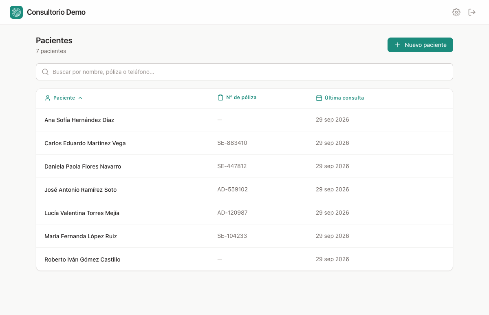
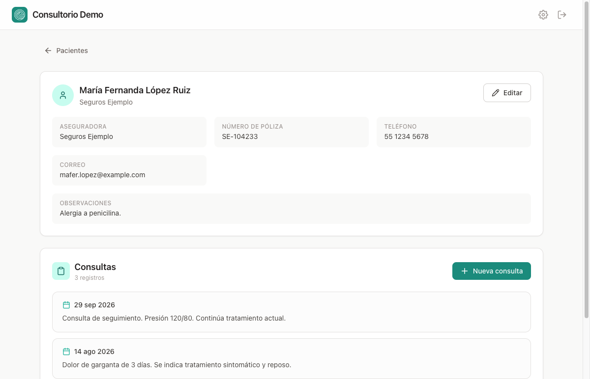
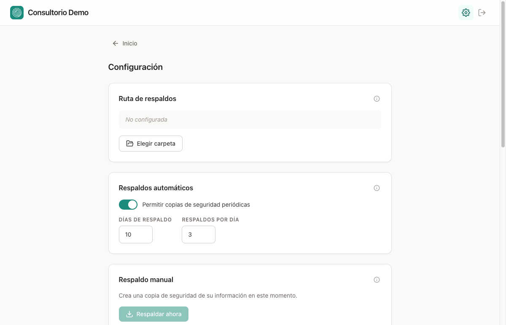
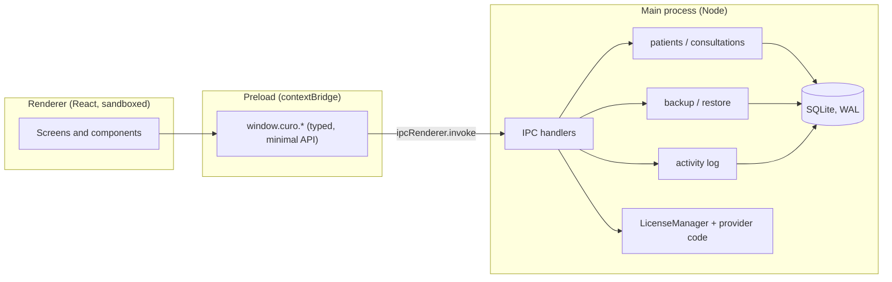

# Curo

[](https://github.com/armando-calz/curo/actions/workflows/build-windows.yml)

Desktop app for doctors to manage patients and consultations, **offline and on their own computer**. It is used daily at a private medical practice in Mexico.

Electron · React · TypeScript · Tailwind CSS · SQLite (better-sqlite3) · GitHub Actions

> The UI is in Spanish, the language of its users. All data in the screenshots is fictitious.



| Patient record and consultation history | Settings: backups, license, activity log |
|---|---|
|  |  |

## Features

- **Patients and consultations:** search by name, policy number or phone, sort and paginate. Records are deactivated, never hard-deleted.
- **Backups that survive real life:** automatic periodic backups and a backup on every close, with configurable retention (days, backups per day), plus one-click manual backup.
- **Safe restore:** a restore first snapshots the current data, so the restore itself can be undone.
- **Activity log with undo:** every change is logged with a snapshot and can be reverted from the log. Old entries are pruned automatically.
- **Offline licensing:** time-limited activation keys verified without any server (see below).
- **Windows installer** built by CI on every version tag.

## Architecture



| Folder | Responsibility |
|---|---|
| `src/main/` | Electron main process: database, backups, activity log, licensing, IPC handlers |
| `src/preload/` | The only bridge between UI and Node, exposed through `contextBridge` |
| `src/renderer/` | React UI (Vite + Tailwind) |

## Engineering decisions

- **Process isolation.** The renderer runs with `contextIsolation: true` and `nodeIntegration: false`. It can only call a small, explicit API exposed by the preload, and every privileged operation (file system, database, license) happens in the main process.
- **Local-first data.** One SQLite file in WAL mode. No network dependency, so the practice keeps working without internet.
- **Consistent backups.** Backups use SQLite's `VACUUM INTO`, which produces a standalone, compacted copy that is consistent even while the WAL is active. If that fails, it falls back to a checkpoint plus a file copy.
- **Reversible operations.** Soft deletes, logged snapshots and pre-restore backups make the destructive actions a non-technical user can trigger recoverable.
- **Offline licensing with HMAC.** An activation key is 12 bytes encoded in Base32 (`XXXXX-XXXXX-XXXXX-XXXXX`): expiry, issue time, activation window and a nonce, authenticated with a truncated HMAC-SHA256 and compared in constant time. Each client build has its own secret, so keys are not transferable between clients.
- **Provider access.** Support actions (such as revoking a license) require a code that changes daily and is derived from the client's secret. It is verified in the main process, so the UI cannot bypass it.

## Try the demo

1. Download `Curo-Demo-Setup-<version>.exe` from [Releases](https://github.com/armando-calz/curo/releases) (Windows).
2. Generate a demo activation key (requires Node 18+):

   ```bash
   node scripts/gen-dev-key.mjs 30 24   # valid for 30 days, activate within 24 h
   ```

The demo build uses the public development secret, so these keys only work on the demo.

## Development

```bash
npm install
cp src/main/license/buildSecrets.demo.ts src/main/license/buildSecrets.ts   # dev secrets, not committed
npm run dev
```

Opens the Electron window with the UI served by Vite (`http://localhost:5173`).

## Releases

- **Demo (public).** Pushing a tag `vX.Y.Z` (matching `version` in `package.json`) runs the **Build Windows (demo)** workflow, which attaches `Curo-Demo-Setup-X.Y.Z.exe` to the GitHub Release.
- **Client builds (private).** Put the client's `buildSecrets.ts` in `src/main/license/` and run `npm run dist:win`, which also works on macOS. The installer is written to `release/` and delivered to the client privately. Client builds never run in CI, because workflow artifacts of a public repository are downloadable by any GitHub user.

License key and provider code generation is documented in [`scripts/README-licencias.md`](scripts/README-licencias.md).
